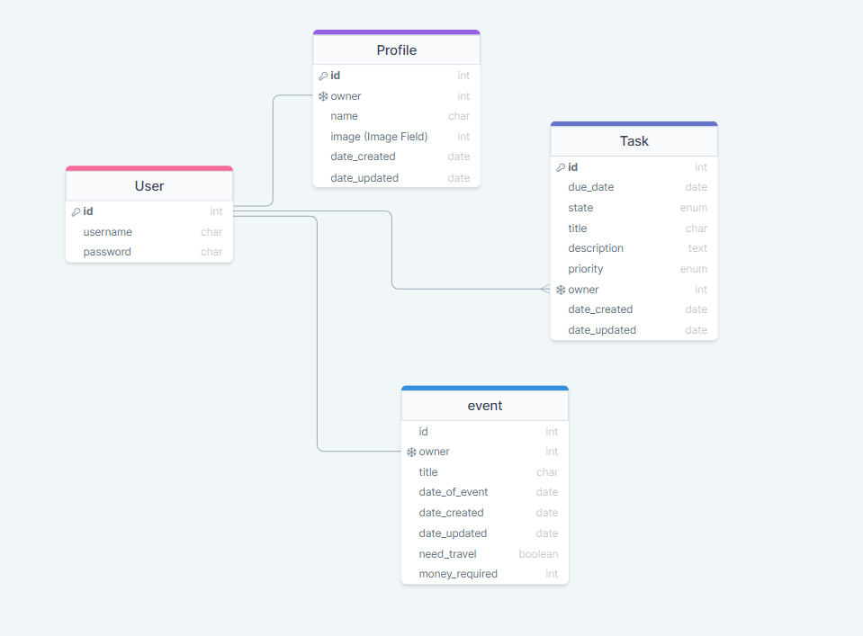

# Taskosaurus Backend API

Taskosaurus is a website where the user can sign up and log in with their own profile. From here they are able to create two key items: <em>Tasks</em> and <em>Events</em>. Tasks are things that the user needs to do by a certain date in a work context and Events are things that happen on a certain date and are usually either leisurely or act as milestones in someone's life like a birthday party).

Users can then view their Tasks or Events in the respective list views and can filter based on the Current/ Archived split for the Tasks and whether it is upcoming or in the past for the Events. The Tasks list view will also highlight if the task is overdue and not complete by changing the background color of it in the list view to alert the user.

Users can also view details about a specific Task or Event by clicking on a link from the list view and will then be taken to a detail view. From here they will be able to view details of that specific Task or Event and will be able to edit it or delete the item from their Profile entirely.

The user is also able to edit their profile and change their profile picture which is displayed on the navigation bar.

Taskosaurus has a separate backend API and frontend and this README deals with the backend API section of the site.

## Demo
[Live Deployment of API](https://taskosaurus-backend.herokuapp.com/)

## Frontend Links
As Taskosaurus is split between the frontend and the backend here are links to the frontend:

[Frontend Repo](https://github.com/CarlG96/taskosaurus-frontend)
<!--Frontend Deployment-->

## User Stories and Kanban Board
The Taskosaurus project was created using a GitHub Projects Kanban Board to simulate an agile workflow. The Kanban board for the project which includes both backend and frontend tasks can be found here:

[Taskosaurus Kanban Board](https://github.com/users/CarlG96/projects/6)

## Model Diagram

The Model below was designed in order to create a relationship diagram to be used as a reference when creating the models in the Django Rest API. All three custom models (Profile, Task and Event) were related to a standard Django Auth User class.

### Profile Model
The Profile Model contains the following fields:

- id (int): Auto-generated attribute which represents unique id (hidden).
- owner (OneToOne): Represents a one-to-one relationship with a specific User instance.
- date_created (DateTime): Date and time of creation of the Profile.
- date_updated (DateTime): Date and time Profile was last updated.
- image (file): Image that is displayed in the user's profile. Represents the user.

### Task Model
The Task Model contains the following fields:

- id (int): Auto-generated attribute which represents unique id (hidden).
- due_date (DateTime): Date and time when task must be completed by. Must be at least one day from the time of creation.
- date_created (DateTime): Date and time of creation of the Task.
- date_updated (DateTime): Date and time Task was last updated.
- state (enum): Represents whether the Task is Current or has been completed and is therefore Archived.
- title (str): Represents the title of the Task.
- description (str): Represents the description of the Task.
- priority (enum): Represents how urgent this task is specifically.
- Can be 'Must Do', 'Might Do' and 'Can Do'.
- owner (ForeignKey): Primary key of User that this Task is linked with.

### Event Model
The Event Model contains the following fields:

- id (int): Auto-generated attribute which represents unique id (hidden).
- date_created (DateTime): Date and time of creation of the Event.
- date_updated (DateTime): Date and time when Event was last updated.
- need_travel (bool): Represents whether the user must travel for this Event.
- money_required (int): Represents the amount of money required (est) for this Event. Defaults to 0 and cannot be negative.
- owner (ForeignKey): Primary key of User that this Event is linked with.

