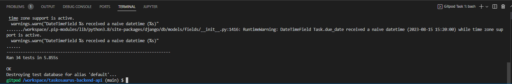

# Taskosaurus Backend API

Taskosaurus is a website where the user can sign up and log in with their own profile. From here they are able to create two key items: <em>Tasks</em> and <em>Events</em>. Tasks are things that the user needs to do by a certain date in a work context and Events are things that happen on a certain date and are usually either leisurely or act as milestones in someone's life like a birthday party).

Users can then view their Tasks or Events in the respective list views and can filter based on the Current/ Archived split for the Tasks and whether it is upcoming or in the past for the Events. The Tasks list view will also highlight if the task is overdue and not complete by changing the background color of it in the list view to alert the user.

Users can also view details about a specific Task or Event by clicking on a link from the list view and will then be taken to a detail view. From here they will be able to view details of that specific Task or Event and will be able to edit it or delete the item from their Profile entirely.

The user is also able to edit their profile and change their profile picture which is displayed on the navigation bar.

Taskosaurus has a separate backend API and frontend and this README deals with the backend API section of the site.

## Demo
[Live Deployment of API](https://taskosaurus-backend.herokuapp.com/)

## Frontend Links
As Taskosaurus is split between the frontend and the backend here are links to the frontend:

* [Frontend Repo](https://github.com/CarlG96/taskosaurus-frontend)

* [Taskosaurus Frontend Deployment](https://taskosaurus.herokuapp.com/)

## User Stories and Kanban Board
The Taskosaurus project was created using a GitHub Projects Kanban Board to simulate an agile workflow. The Kanban board for the project which includes both backend and frontend tasks can be found here:

* [Taskosaurus Kanban Board](https://github.com/users/CarlG96/projects/6)

### Sprint Method

The Taskosaurus project was developed in a series of sprints which were each seven days long, starting at Sprint 0. Each User Story on the Kanban Board except those not completed have been assigned a specific Milestone in order to show which sprint they were completed on. Not all sprints were of equal value because of outside factors but User Stories were split into 'Must Have', 'Should Have' and 'Could Have' labels which designated what I thought they should be categorised as at the start of a sprint as I added items to the 'In Progress' section of the board. 

The 'SP:*' labels were used to designate how long I assumed each task would take based on a number of 'story points'. These were assigned at the start of each Sprint.

### User Stories

Here are links to user stories involving the Taskosaurus API:

* [API Development](https://github.com/users/CarlG96/projects/6/views/1?filterQuery=api+development)

* [API Testing](https://github.com/users/CarlG96/projects/6/views/1?filterQuery=api+testing)

## Models

The Model below was designed in order to create a relationship diagram to be used as a reference when creating the models in the Django Rest API. All three custom models (Profile, Task and Event) were related to a standard Django Auth User class.

### Profile Model
The Profile Model contains the following fields:

- id (int): Auto-generated attribute which represents unique id (hidden).
- owner (OneToOne): Represents a one-to-one relationship with a specific User instance.
- date_created (DateTime): Date and time of creation of the Profile.
- date_updated (DateTime): Date and time Profile was last updated.
- image (file): Image that is displayed in the user's profile. Represents the user.

### Task Model
The Task Model contains the following fields:

- id (int): Auto-generated attribute which represents unique id (hidden).
- due_date (DateTime): Date and time when task must be completed by. Must be at least one day from the time of creation.
- date_created (DateTime): Date and time of creation of the Task.
- date_updated (DateTime): Date and time Task was last updated.
- state (enum): Represents whether the Task is Current or has been completed and is therefore Archived.
- title (str): Represents the title of the Task.
- description (str): Represents the description of the Task.
- priority (enum): Represents how urgent this task is specifically.
- Can be 'Must Do', 'Might Do' and 'Can Do'.
- owner (ForeignKey): Primary key of User that this Task is linked with.

### Event Model
The Event Model contains the following fields:

- id (int): Auto-generated attribute which represents unique id (hidden).
- date_created (DateTime): Date and time of creation of the Event.
- date_updated (DateTime): Date and time when Event was last updated.
- need_travel (bool): Represents whether the user must travel for this Event.
- money_required (int): Represents the amount of money required (est) for this Event. Defaults to 0 and cannot be negative.
- owner (ForeignKey): Primary key of User that this Event is linked with.

## Testing

I targetted the Taskosaurus API with both manual and automated testing in order to make sure that things were working as expected.

### Manual Testing

The markdown file describing the manual tests can be found in the [MANUAL_TESTS.md](MANUAL_TESTS.md) file. It describes the steps I went through to manually ensure that the API worked correctly.

### Automated Testing

I also created a series of automated testing suites from which I set up some tests in order to find any hidden bugs that manual testing would have been unable to find and also to reinforce the manual tests. Here is an image showing the completeness of the tests:

Note: The naive datetime warning is likely due to the fact that the testing suite includes hardcoded dates. I have set these dates at least five months in advance of when this prohect will be handed in. In a real world scenario I would change this to ensure the longterm capability of the automated tests but felt it would be an unnecessary amount of time spend given the scope of this project.

## Technology

### Languages

- Python

### Frameworks

- Django
- Django Rest Framework

### Packages used

- cloudinary - Used for serving images.
- django-cloudinary-storage - Used for integration of Cloudinary.
- django-allauth - Used for sign up and login for users.
- dj-rest-auth - Used for API endpoints.
- django-filter - Allow filtering.
- django-cors-headers - Allows CORS headers to responses.
- Pillow - image processing.
- djangorestframework-simplejwt - JSON Web Token authentication.
- psycopg2 - Connects Python and PostgreSQL databases.
- gunicorn - Python WSGI HTTP Server.

### Programs used for development

- [drawSQL](https://drawsql.app/) - For the ERD (Entity Relationship Diagram).
- Gitpod - Used for the development of the project as a cloud based IDE.
- Git - Used for version control
- GitHub - Used for the remote repo of the project but also used for the Kanban Board.

## Deployment

### Forking/ Cloning

You can fork the repository with the following steps:

1. Login to your GitHub account
1. Locate the repository you wish to fork
1. Click the 'Fork' button and you'll have a copy of the repo on your own account.

You can clone the repo with the following steps:

1. Under the 'Code' button in the repository, copy the HTTPS link.
1. With Git on your local machine, find the directory you want to clone into and set up a Git Bash terminal there.
1. Type git clone followed by the link to set up the clone on your own system.
Note: Your own environment will be different from the original so you will need to set up environment variables and install the requirements for it to run.

### Deployment to Heroku

1. I logged in and created the app.
1. After the app was created, linked an Elephant SQL database in the config vars for DATABASE_URL.
1. Set the other config vars, including ALLOWED_HOSTS, CLIENT_ORIGIN (for the frontend), CLIENT_ORIGIN_DEV, CLOUDINARY_URL, SECRET_KEY and DISABLE_COLLECTSTATIC.
1. Set the Deployment of the project by clicking on the 'Deploy' tab and choosing the method of deployment (I connected to my GitHub and had automatic deploys).
1. The application deployed after an initial manual deploy.

## Credits

- Code Institute Django Rest Framework Tutorial for the setup for the project and basis on which I worked.
- [Django Rest Framework Documentation](https://www.django-rest-framework.org/) for helping me come unstuck a few times.

