# Testing

## Manual Testing

Here are a list of manual tests carried out to ensure that the Taskosaurus backend API works correctly at time of deployment. These tests are designed to test each created view for functionality. I will not be testing authorisation routes for the Django Rest Framework or admin views as those can be assumed to work correctly.

## Root Route View

* The Root Route exists purely to demonstrate that the API is working as intended.

    * Test: A non-logged in user should see the message: "Welcome to Taskosaurus API!".
    * Result: A non-logged in user does see the message: "Welcome to Taskosaurus API!".

    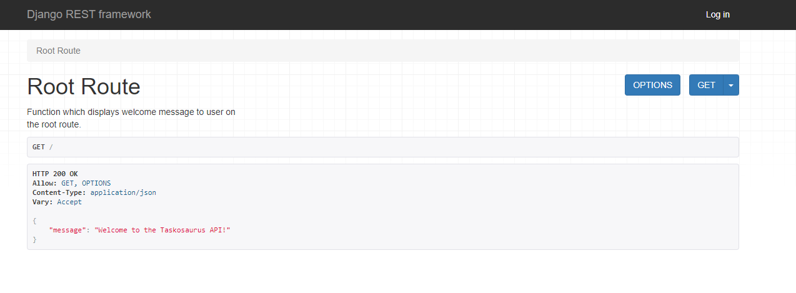

    * Test: A logged in user should see the message: "Welcome to Taskosaurus API!".
    * Result: A logged in user does see the message: "Welcome to Taskosaurus API!".

    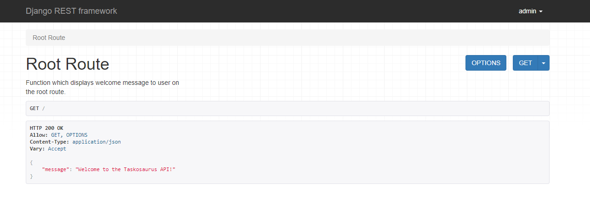

## Profile List View

* This route exists to provide a list of the Profile models.
    * Test: A non-logged in user should be able to see a list of the Profile models.
    * Result: A non-logged in user can see this.
    * Test: The 'is_owner' field on each Profile will return false for every single Profile model when a non-logged in user is viewing this view.
    * Result: Each Profile returns false for the 'is_owner' field.

    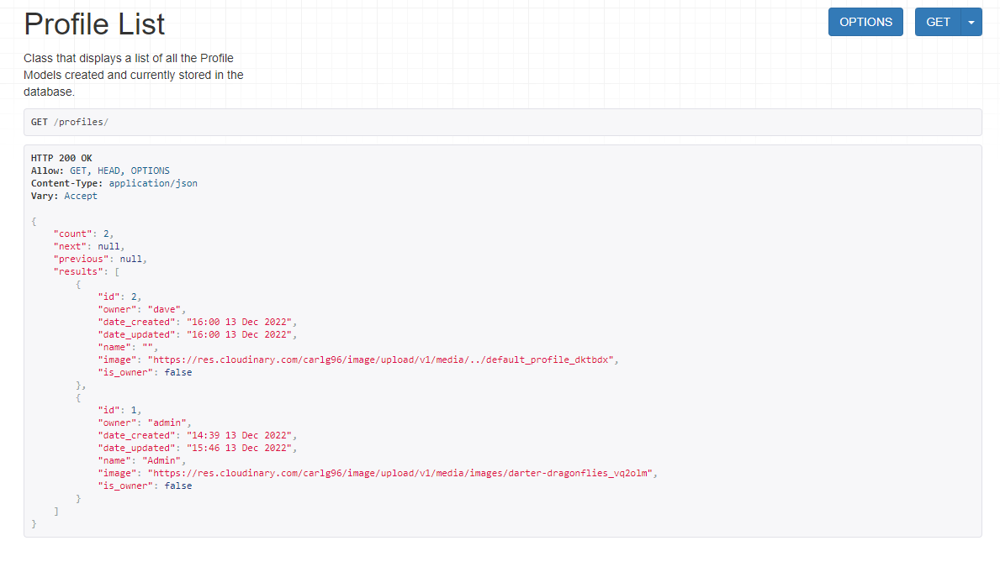

    * Test: Logging in as one user should change the 'is_owner' field to true for that user.
    * Result: The 'is_owner' field returns true for that user but for others returns false.

    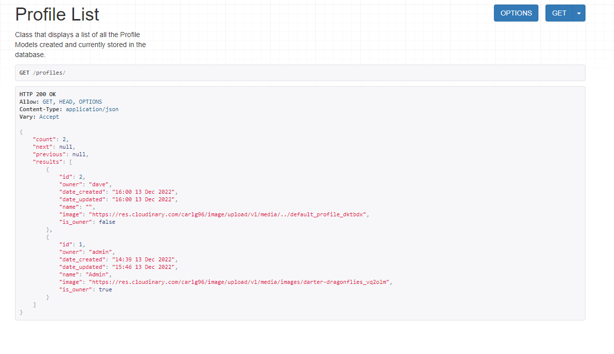

    * Test: Logging in as another user changes the 'is_owner' field to be true for that user.
    * Result: The 'is_owner' field return true for the other user and all others return false.

    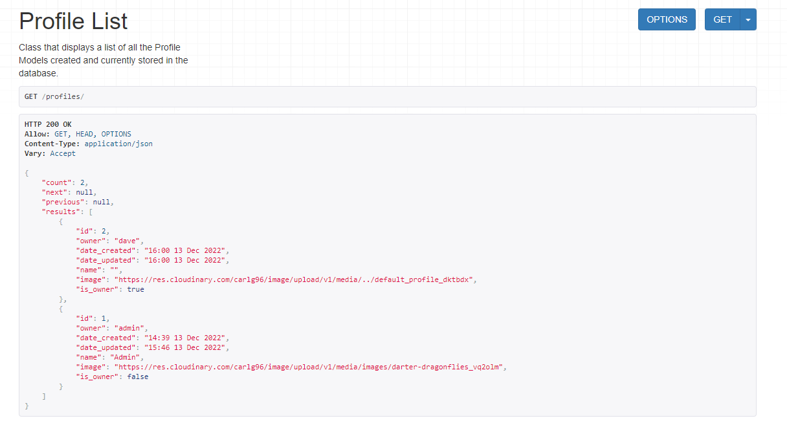

## Profile Detail View

* This route exists to provide a detail view of the Profile model and to allow updates via put request if the user is the owner of the specific Profile instance.
    * Test: A non-logged in user can view Profile detail views but cannot update them.
    * Result: A non-logged in user can view Profile detail views but cannot update them.

    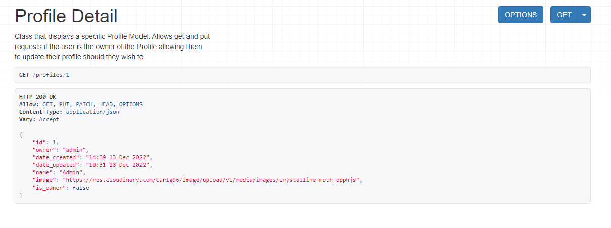

    * Test: A logged in user can view another user's Profile detail view but cannot update it.
    * Result: This is true.
    * Test: A logged in user will be presented with a form to update their Profile when on the Profile detail view of their Profile.
    * Result: They are presented with the form.

    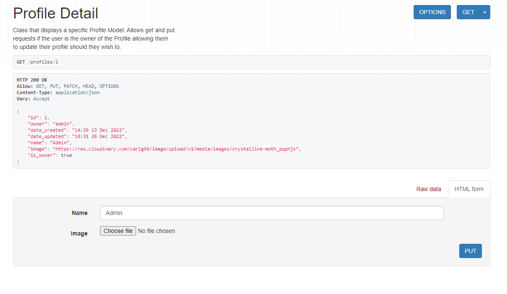

    * Test: A logged in user can change the 'name' field of their Profile by changing it on the Profile detail view and submitting a put request.
    * Result: Changing the 'name' field is possible for that user.
    * Test: A logged in user can change the 'image' field by uploading a file and making a put request.
    * Result: Changing the 'image' field is possible for that user.

    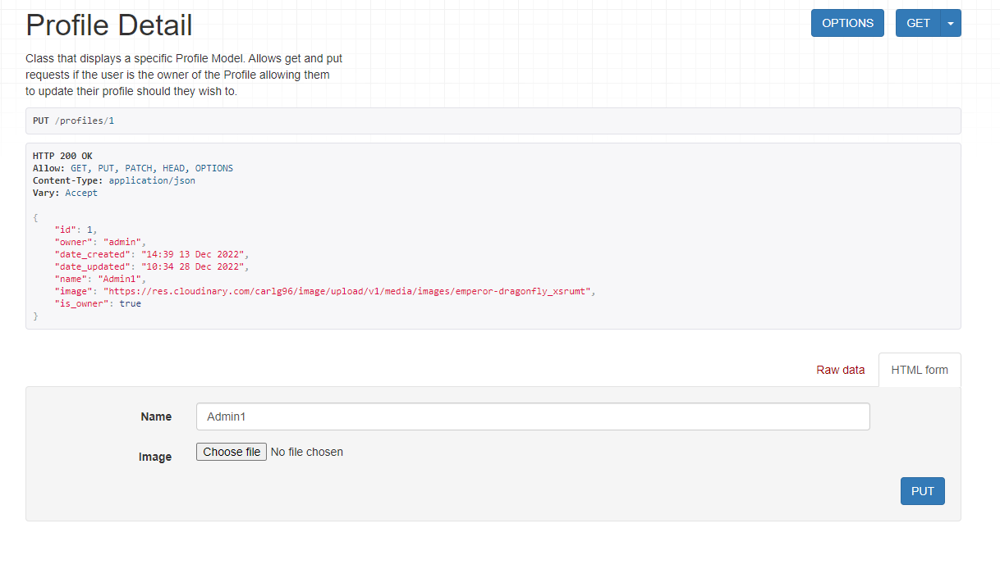

## Task List View

* This route exists to provide a list view of all the Task models that they own and to allow the user to create new tasks via post request if they are logged in.
    * Test: A non-logged in user can view the Task list but has no option to post a new Task and cannot see any Tasks.
    * Result: A non-logged in user can view the Task list but cannot add to it and cannot see any Tasks.

    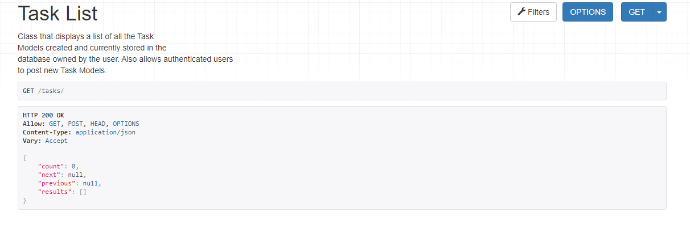

    * Test: A logged in user can view the Task list and has an option to post a new Task, they can only see their own Tasks.
    * Result: A logged in user can view the Task list and is presented with a form to post a new Task, and can only see their own Tasks.

    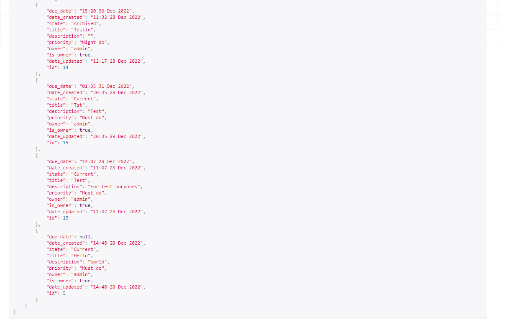

    * Test: A logged in user can post a new Task when all the relevant fields are filled in correctly. They are then redirected to the relevant Task detail view.
    * Result: A logged in user can do this.
    * Test: A new Task instance must have its 'due_date' field set at least 24 hours in the future to be considered valid. Otherwise it will cause a validation error.
    * Result: This will return a HTTP 400 Bad Request response if it is not set atleast 24 hours in the future.

    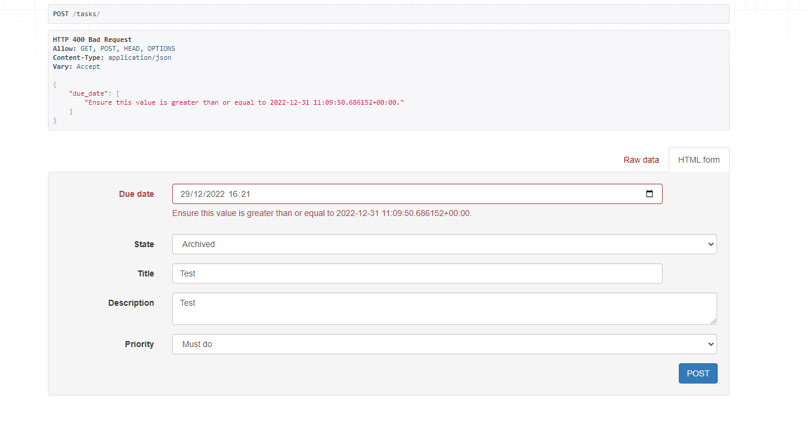

    * Test: A new Task instance must have a value for the 'title' field to be considered valid.
    * Result: This will return a HTTP 400 Bad Request response if there is no value for the title.

    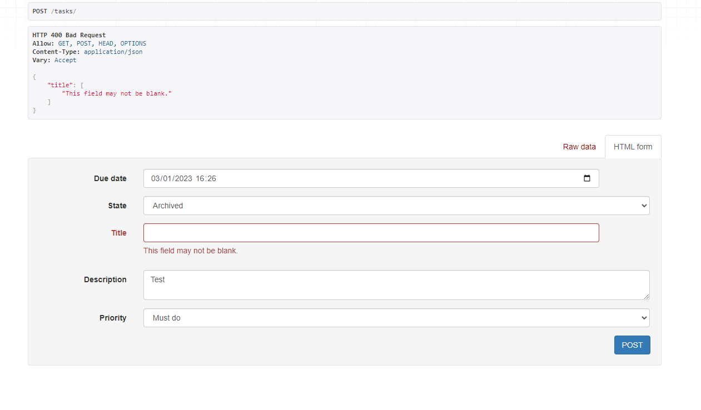

## Task Detail View

* This route exists to provide a detail view of a single Task model. An owner of the Task should be able to delete the Task via a delete request and update the Task via a put request.
    * Test: A non-logged in user won't be able to view the Task instance and cannot change or delete the Task instance.
    * Result: A non-logged in user is unable to view the Task instance and cannot change or delete the instance.

    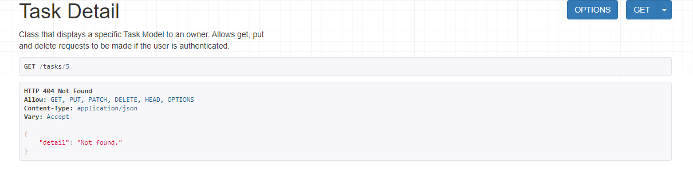

    * Test: A logged in user cannot change or delete a Task instance that they are not the owner of.
    * Result: A logged in user cannot change or delete Tasks which aren't theirs (the put method and delete method in the picture does not work).
    * Test: A logged in user can change the 'due_date' field of a Task instance that they own.
    * Result: A logged in user can change this.

    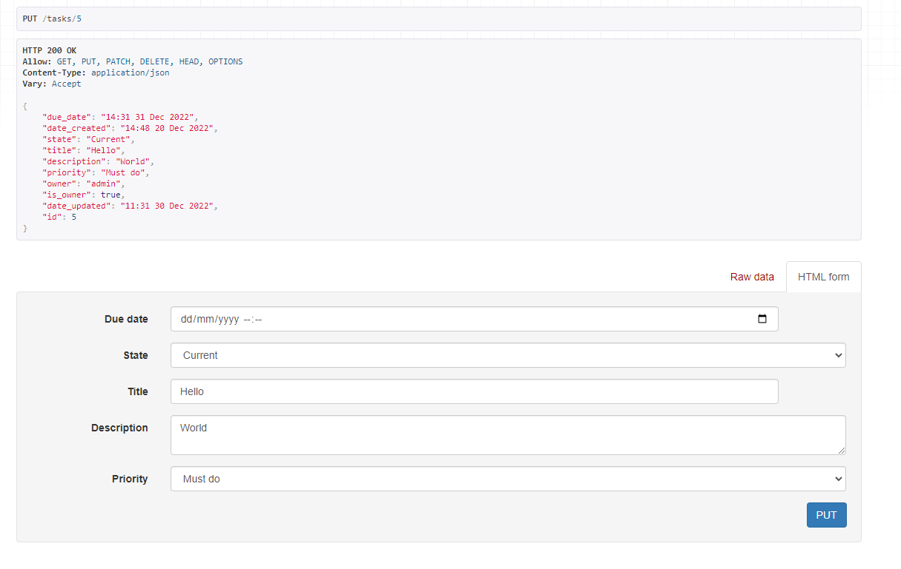

    * Test: A logged in user can change the 'state' field of a Task instance that they own.
    * Result: This is possible.
    * Test: A logged in user can change the 'title' field of a Task instance that they own.
    * Result: This is possible.
    * Test: A logged in user can change the 'description' field of a Task instance that they own.
    * Result: This is possible. The description field can even be left blank after having had a value in it.
    * Test: A logged in user can change the 'priority' field of a Task instance that they own.
    * Result: This is possible.
    * Test: A logged in user can't change the 'due_date' field to be less than at least a day away from the current datetime.
    * Result: This will return a HTTP 400 Bad Request response if it is not set atleast 24 hours in the future.

    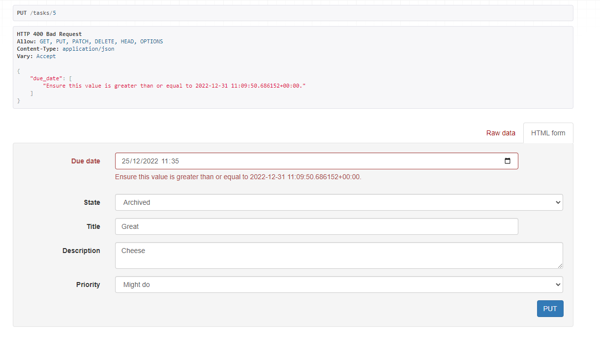

    * Test: A logged in user can't change the 'title' field to a blank value.
    * Result: This will return a HTTP 400 Bad Request.

    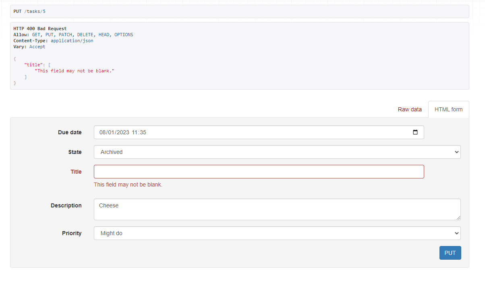

    * Test: A logged in user can delete a Task instance that they own.
    * Result: A logged in user can do this.

    NOTE: The put method and delete methods seem to be there for the logged out users however they have no affect and I think
    this is a Django bug or it might be because there are no objects to compare ownership against.

## Event List View
* This route exists to provide a list view of all the Event models that the user owns and to allow the user to create new tasks via post request if they are logged in.
    * Test: A non-logged in user can view the Event list but has no option to post a new Event and cannot see any Event.
    * Result: A non-logged in user can view the Event list but has no option to post a new Event and cannot see any Event.

    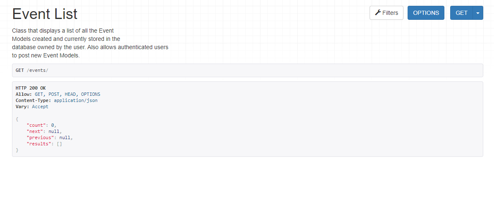

    * Test: A logged in user can view the Event list and see their Events and has the option to post new Events.
    * Result: A logged in user can do this.

    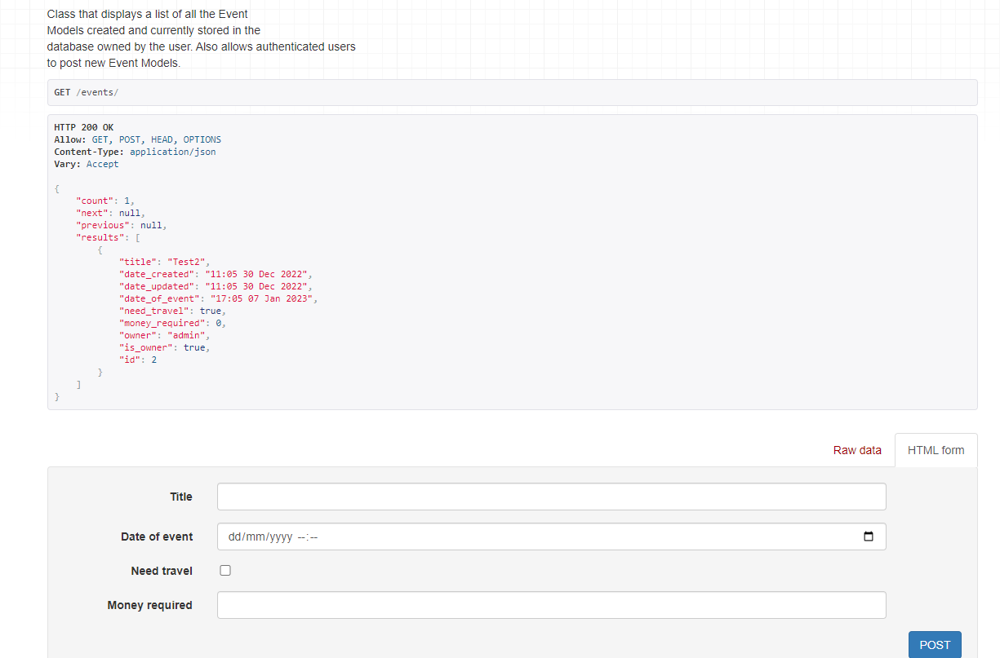

    * Test: A logged in user can post a new Event when all the relevant fields are filled in correctly. They are then redirected to the relevant view.
    * Result: This happens
    * Test: A new Event instance must have its 'due_date' field set at least 24 hours in the future to be considered valid. Otherwise it will cause a validation error.
    * Result: This will return a HTTP 400 Bad Request response if it is not set atleast 24 hours in the future.

    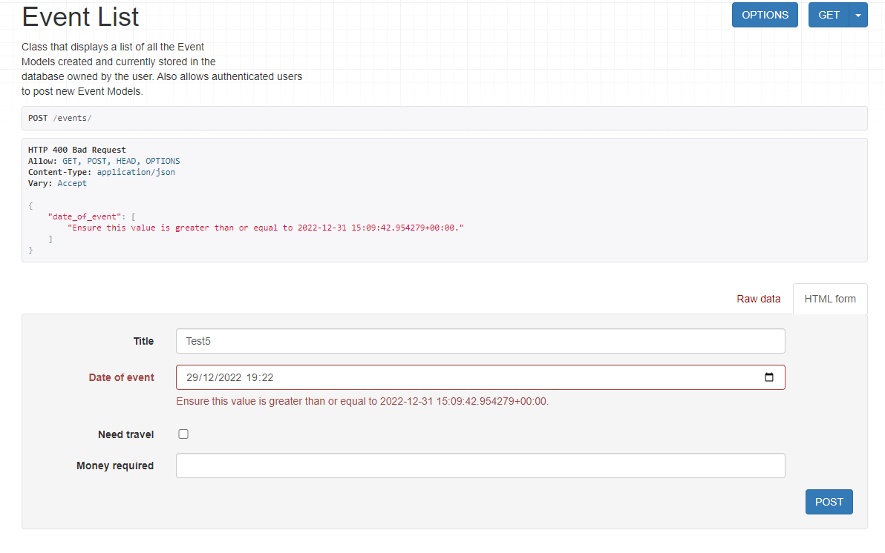

    * Test: A new Event instance must have a value for the 'title' field to be considered valid.
    * Result: This will return a HTTP 400 Bad Request response if there is no value for the title

    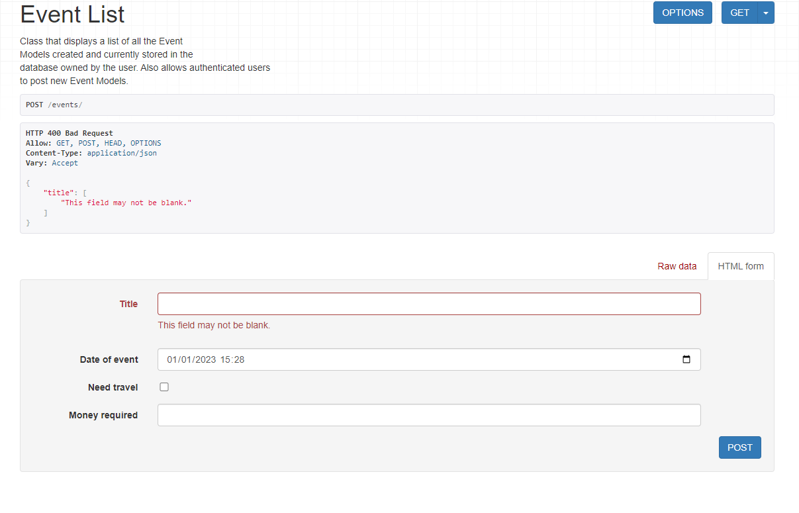

## Event Detail View
* This route exists to provide a detail view of a single Event model. An owner of the Event should be able to delete the Task via a delete request and update the Task via a put request.
    * Test: A non-logged in user won't be able to view the Event instance and cannot change or delete the Task instance.
    * Result: A non-logged in user is unable to view the Event instance and cannot change or delete the instance.

    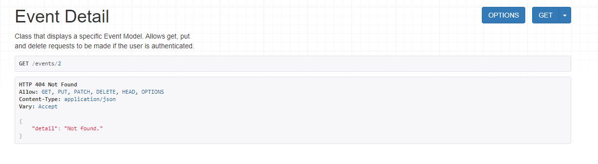

    * Test: A logged in user cannot change or delete an Event instance that they are not the owner of.
    * Result: A logged in user cannot change or delete Events which aren't theirs (the put method and delete method in the pictures do not work).
    * Test: A logged in user can change the 'due_date' field of an Event instance that they own.
    * Result: A logged in user can change this.
    * Test: A logged in user can change the 'title' field of an Event instance that they own.
    * Result: A logged in user can change this.
    * Test: A logged in user can change the 'need_travel' field of an Event instance that they own.
    * Result: A logged in user can do this.
    * Test: A logged in user can change the 'money_required' field of an Event instance that they own.
    * Result: A logged in user can do this.
    * Test: A logged in user can't change the 'due_date' field to be less than at least a day away from the current datetime.
    * Result: This will return a HTTP 400 Bad Request response if it is not set atleast 24 hours in the future.

    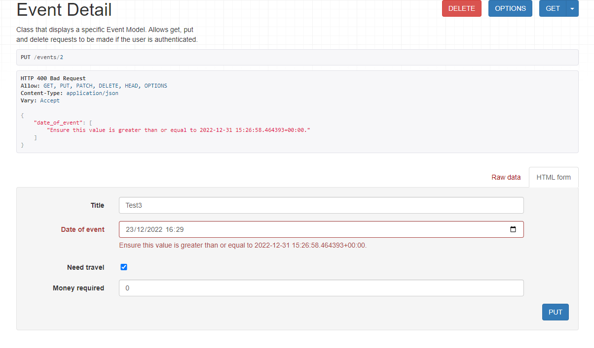

    * Test: A logged in user can't change the 'title' field to a blank value.
    * Result: This will return a HTTP 400 Bad Request.

    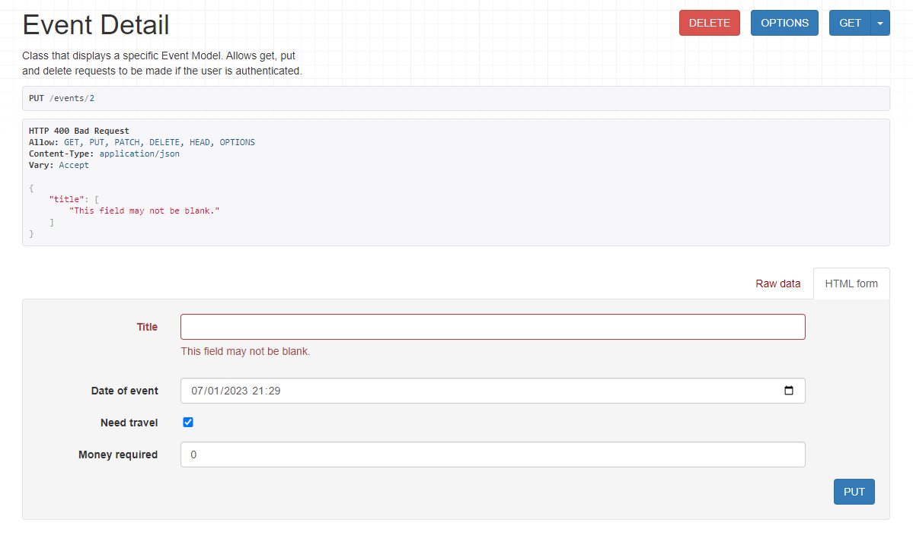

    * Test: A logged in user can delete Events that they own.
    * Result: A logged in user can do this.

    NOTE: The put method and delete methods seem to be there for the logged out users however they have no affect and I think
    this is a Django bug or it might be because there are no objects to compare ownership against.
